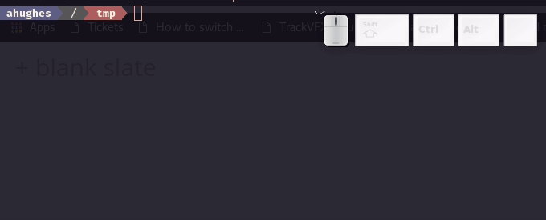
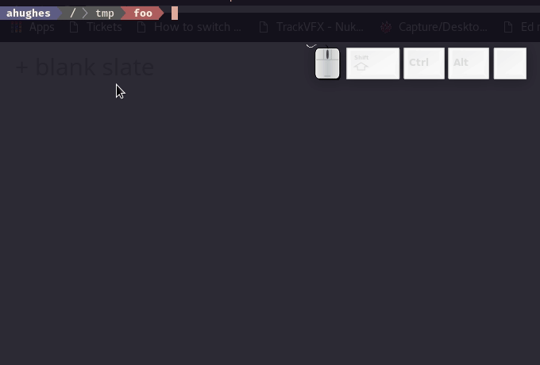

# imod

imod is an interactive `chmod` tool.

It is written in python and uses a raw terminal to allow it to catch all escape sequences.

## Commands
  - Ctrl + C          Exit
  - Return            Apply chmod permissions to file [& Exit]
  - Up Arrow          Increase octal permission
  - Down Arrow        Decrease octal permission
  - Left Arrow        Move cursor left in permissions
  - Right Arrow       Move cursor right in permissions
  - [r|w|x|-]         Set one or more of these ascii permissions to that group
  - [0-7]             Set one octal permission to that group

## Demo

Basic demo of imod showing a use case  

A more advanced usage of imod

